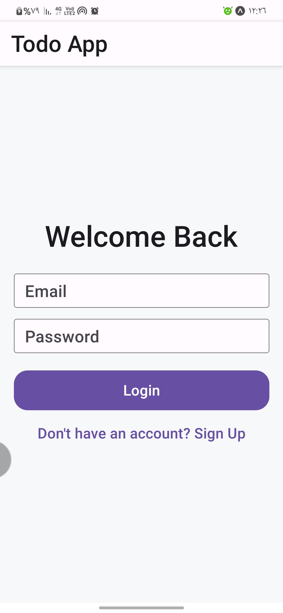
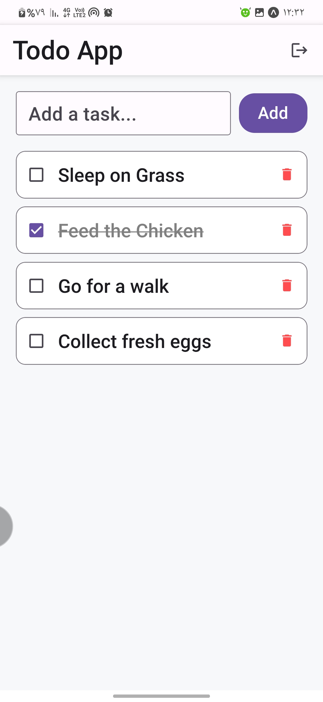

# Todo List App

A task management application consisting of a mobile interface and a backend server. It allows users to register, sign in, and manage their daily tasks.

## Screenshots

### Login Screen


### Task Management Screen


## Project Structure

- **App**: Mobile application built with React Native and Expo.
- **Server**: Backend application built with Express and MongoDB.

## Getting Started

### Prerequisites

- Node.js installed on your computer.
- Expo Go application installed on your mobile device.
- MongoDB database access.

### Running the Server

1. Open a terminal in the `server` directory.
2. Install dependencies:
   ```bash
   npm install
   ```
3. Set up the `.env` file with your database link.
4. Start the server:
   ```bash
   npm start
   ```

### Running the Mobile App

1. Open a terminal in the root directory.
2. Install dependencies:
   ```bash
   npm install
   ```
3. Start the application:
   ```bash
   npx expo start
   ```
4. Scan the QR code with the Expo Go app on your phone.
